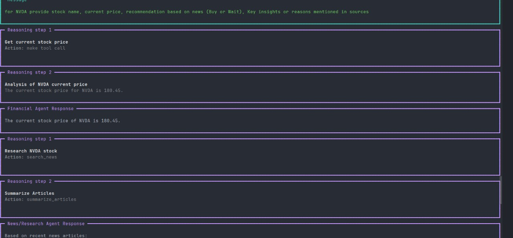
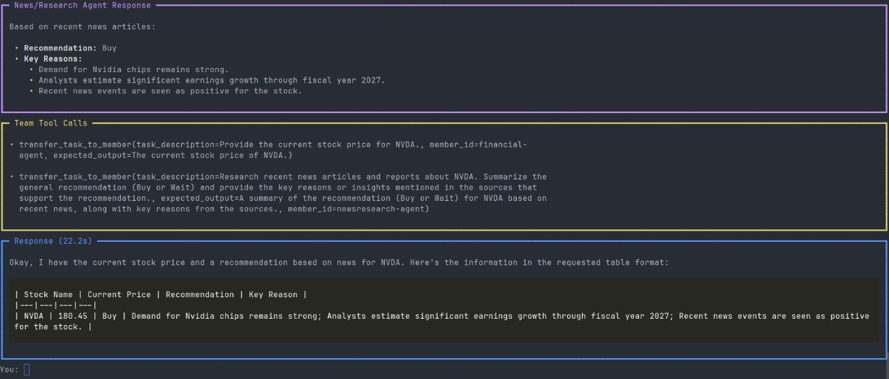
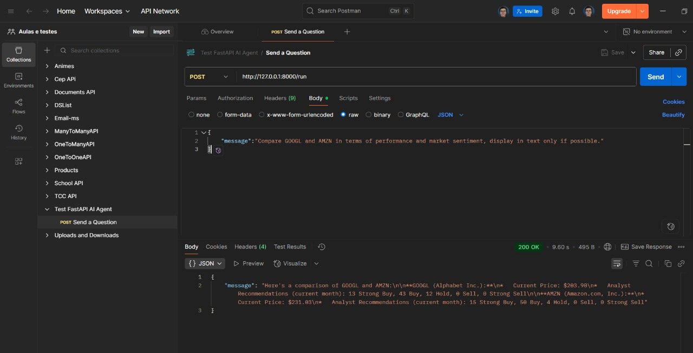

# Investment AI Agent Team


## 🔹 Sobre o Projeto

O Investment AI Agent Team é um sistema de agentes inteligentes focado no mercado de ações dos Estados Unidos.
Ele combina análise quantitativa e análise qualitativa para fornecer informações consolidadas sobre ações em formato de chat interativo ou via API FastAPI, ajudando usuários a entender se é hora de comprar ou esperar em relação a cada ativo solicitado.

---

⚠️ Restrições e Limitações

O Investment AI Agent Team depende de chaves de API para acessar dados financeiros e realizar pesquisas. Algumas limitações importantes devem ser consideradas:

Chave gratuita: Se você estiver usando uma chave gratuita (Google API ou Financial Datasets API), pode enfrentar restrições no número de requisições permitidas.

Volume de dados: Pesquisar uma grande quantidade de ações ou obter históricos extensos pode não funcionar corretamente com limites gratuitos.

Uso de tokens: Consultas que envolvem muitos dados ou análise detalhada podem consumir rapidamente os tokens disponíveis, impactando a quantidade de informações retornadas.

Recomendações: Para análises mais intensivas ou em larga escala, considere utilizar uma chave paga ou limitar a quantidade de ações consultadas por vez.

💡 Dica: Para testes e aprendizado, é recomendado começar com perguntas mais simples e diretas, dando informações chave para o modelo.

---

## 🎯 Objetivo

- Criar agentes especializados que trabalham em conjunto para analisar o mercado americano.

- Obter dados quantitativos sobre ações (preço atual, histórico, recomendações de analistas).

- Extrair informações qualitativas de notícias recentes e relatórios.

- Consolidar resultados em uma tabela ASCII com nome da ação, preço, recomendação e motivo principal, podendo incluir links externos.

- Permitir interação contínua via chat no terminal ou requisições HTTP.

---

## 🛠 Tecnologias e Ferramentas

- **Python 3.13**
- **[Agno](https://github.com/google/agno)** (versão 1.7.11)
- **YFinanceTools** para dados financeiros
- **FinancialDatasetsTools** para dados históricos e análises de mercado
- **GoogleSearchTools** e **WebBrowserTools** para pesquisas de notícias
- **FastAPI** para expor endpoints HTTP
- **dotenv** para variáveis de ambiente

---

## 📸 Demonstração na Prática

Veja abaixo algumas imagens do **Investment AI Agent Team** rodando diretamente no terminal, mostrando as análises de ações e recomendações consolidadas em tabelas ASCII:




### Com **FastAPI**


---

## 📚 Exemplos de uso (inputs)
- "Analyze AAPL and MSFT stocks and tell me if now is a good time to buy or wait."

- "Check TSLA and NVDA. Should I invest based on the latest news and analyst recommendations?"

- "Compare GOOGL and AMZN in terms of performance and market sentiment."

- "Give me an update on JPM and BAC. Are banks looking good for investment right now?"

- "Analyze META and NFLX, considering recent news and stock price trends."

- "What do analysts say about AMD and INTC? Should I hold or buy?"

- "Check BRK-B and V for growth potential and risks."

- "Compare DIS and WMT. Which has better momentum?"

---

## ⚙️ Configuração do Projeto

1. Crie um **.venv**:
```bash

python -m venv .venv
```

2. Ative o **.venv**
- Windows
```bash

.venv\Scripts\activate
```
- Linux
```bash

source .venv/bin/activate
```

3. Instale as dependências:
```bash

pip install -r requirements.txt
```

4. Crie um arquivo **.env** na raiz do seu projeto com suas chaves:
```
GOOGLE_API_KEY=your_google_api_key_here
FINANCIAL_DATASETS_API_KEY=your_financial_datasets_api_key_here
```

---

## 🚀 Como Rodar
### 🔹 Modo Terminal (Chat Interativo)
Execute:
```bash

python main.py
```

O sistema iniciará um chat interativo no terminal, onde você pode digitar perguntas sobre ações e receber análises dos agentes.
Se quiser encerrar o chat digite `quit`, `exit` ou `bye`.

### 🔹 Modo API com FastAPI
Suba o servidor:
```bash

python -m uvicorn main-fastapi:router --reload
```
Por padrão ele rodará em http://127.0.0.1:8000.

#### Endpoint principal:

- POST /run
- Corpo da requisição (JSON):

```json
{
  "message": "Analyze AAPL and MSFT stocks"
}
```

#### Exemplo usando cURL:

```bash

curl -X POST "http://127.0.0.1:8000/run" \
  -H "Content-Type: application/json" \
  -d '{"message":"Analyze TSLA and NVDA"}'
```

A resposta conterá a análise consolidada das ações solicitadas.

---

## 📝 Estrutura do Projeto

```bash

investment-ai-agent-team/
│
├─ agents/
│  ├─ financial_agent.py
│  └─ news_agent.py
│
├─ main.py
├─ main-fastapi.py
├─ .env
├─ requirements.txt
├─ README.md
└─ .gitignore
```

---

## ⚖️ Licença

Este projeto está licenciado sob a MIT License.
